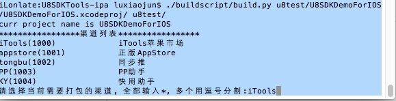
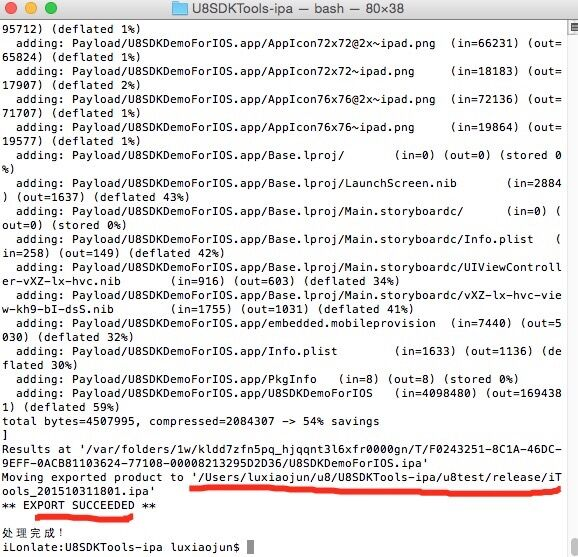

## IOS平台打包
?> _NOTE_  iOS平台的打包工具，只能在mac下进行打包。打包工具根目录为U8SDKTools-ipa

1. 打包命令

启动一个终端，切到打包工具根目录U8SDKTools-ipa，执行如下命令
```
./buildscript/build.py u8test/U8SDKDemo/U8SDKDemo.xcodeproj/ u8test/

其中，
u8test为当前游戏工作目录;
U8SDKDemo为母工程(Android中我们是母包，iOS我们是母工程，也就是一个xcode工程)
```
```
你也可以直接运行切到打包工具根目录，然后运行./buildscript/build.py 来查看这个命令的帮助信息

 xcodeproj:(必须) 指定当前xcode母工程的.xcodeproj的位置
 workspace:(必须) 指定当前游戏的工作目录

 -t, --target  打包使用的target，默认使用和工程目录的文件名相同的名称(建议)
 -p, --pluginpath  指定SDK接入工程所在的目录，默认是Plugins
 -c, --channel 指定特定的渠道。指定这个直接处理工程并打包，不再提示选择渠道。
 -n, --nobuild 仅仅处理xcode工程配置，不进行打包
 -k, --keep 不删除已有的渠道工程，否则重新从母工程拷贝
 --debug    是否为内部Debug版本

Note:打包必须指定母工程位置和当前游戏的工作目录。各个渠道打包的时候，会在指定的游戏工作目录/projects下，生成各个渠道处理后的工程，比如要打出appstore的包，但是我们不能用打包命令打包，我们就先用命令：

./buildscript/build.py u8test/U8SDKDemo/U8SDKDemo.xcodeproj/ u8test/ -n 仅仅处理appstore渠道的xcode工程的配置。

然后我们用xcode打开u8test/U8SDKDemo.appstore工程，进行Achive操作，生成Achive文件，并上传Appstore。

```
2. 准备母工程

iOS平台的打包原理是使用xcode自带的命令工具，同时结合python脚本，动态修改xcode工程的编译信息来完成各个渠道的打包。
所谓母工程，指的是：接入了U8SDK抽象层的游戏工程(xcode工程)
```
U8SDK iOS平台打包工具的配置方式，和Android不太一样，我们采用了更加灵活和简单的方式，直接在打包命令中指定当前需要打包的游戏母工程和工作目录。

所以打包之前，你需要在打包工具根目录下，或者其他任意地方，建立一个游戏工作目录，比如，我们在打包工具根目录下新建一个u8test目录，然后，有两个子目录是必须的，一个是common,一个是channels，建议从已有的其他游戏工作目录中进行拷贝。

xcode母工程中，我们有以下约定：

母工程需要出包的target的名称，和当前母工程的工程名称一致（推荐，也可以打包命令中指定）
母工程打包使用的scheme的名称，和当前母工程的工程名称一致
母工程中，需要引用U8SDK抽象层，同时将libU8SDK.a静态库添加到出包的target的Build Phases中的[Link Binary With Libraries]中
母工程中，可能要添加系统库：SystemConfiguration.framework,libz.dylib,libc++.dylib

然后，我们这里将母工程放到u8test目录下,母工程的名称为U8SDKDemoForIOS(也可以任意目录，打包命令中指定)。这样，我们就准备好了当前游戏的母工程和工作目录了。
```

3. 打包过程

母工程准备好之后，就可以执行打包命令，进行打包了。启动终端，进入打包工具根目录，运行：./buildscript/build.py u8test/U8SDKDemoForIOS/U8SDKDemoForIOS.xcodeproj/ u8test/

首先，提示让我们选择需要打包的渠道：



这里就罗列出了当前支持的所有渠道信息，可以选择需要打包的渠道，输入需要打包的渠道的渠道名，如果需要同时打出多个渠道，用英文的逗号分割，如果要打出全部渠道包，则直接输入*号。

比如我们输入iTools，打出iTools的渠道包。接下来，就是打包过程的日志输出了，这里输出的信息很关键，有时候打包失败，就是需要从这些日志信息中去排查异常和错误。

iOS渠道的打包所耗费的时间，和xcode编译工程的速度相关。主要耗费时间在GenerateDSYMFile的过程。当然这个跟具体的游戏工程相关。



这样就说明打包结束，并成功了。生成的渠道包在当前游戏工作目录/release/目录下。以 [渠道名_时间戳].ipa命名。直接安装这个包，进行测试吧。

4. 异常和问题分析

有时候，打包会遇到"Undefined symbols for architecture armv7" 类似这样的错误，遇到这个，首先检查是否有需要添加的系统库没有添加进来。