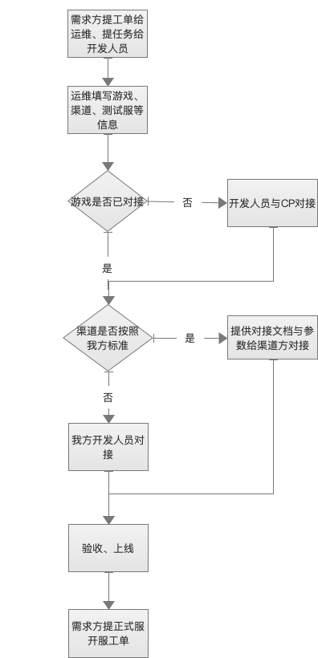

### 页游对接流程图

### 流程说明
1. 需求方提对接工单给运维、提对接任务给开发人员。
2. 运维填写游戏、渠道、测试服等信息。
3. 如果游戏未对接中间层，则需要CP与开发人员对接,如果已经对接过中间层，则进入下一步。
4. 渠道是否按照我方标准对接，如果是则提供页游对接文档以及相应参数给渠道方对接，否则由我方开发人员对接。
5. 对接完之后验收、上线。
5. 需求方提正式服开服工单给运维，运维配置开服。